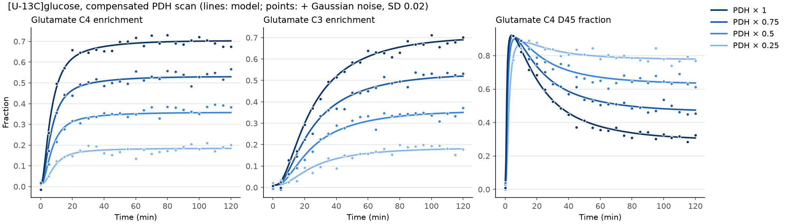
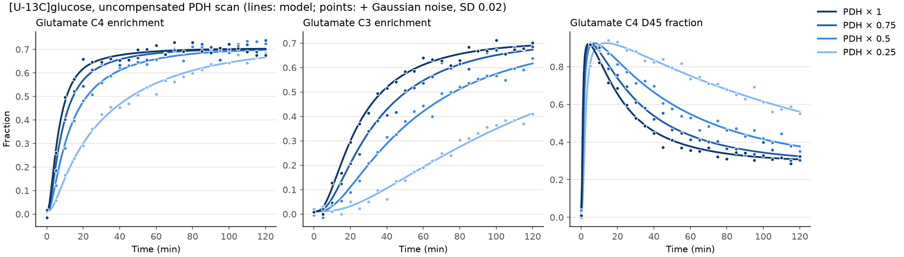

# c13model: ¹³C labeling from [U-¹³C]glucose vs. PDH activity

A Python simulation of brain TCA-cycle ¹³C labeling during an infusion of ¹³C-labeled
glucose. The main input is **pyruvate dehydrogenase (PDH) activity**, and Gaussian
noise can be added to the output to make synthetic NMR data.

The pool structure follows the model of

> Mason GF, Rothman DL, Behar KL, Shulman RG. *NMR determination of the TCA cycle rate
> and α-ketoglutarate/glutamate exchange rate in rat brain.* J Cereb Blood Flow Metab.
> 1992;12(3):434-447. doi:[10.1038/jcbfm.1992.61](https://doi.org/10.1038/jcbfm.1992.61). PMID 1349022.

Mason et al. modeled [1-¹³C]glucose, which labels one carbon at a time. This model extends
theirs to multiply-labeled tracers such as [U-¹³C]glucose. Each pool carries its **full
isotopomer distribution** (all 2ⁿ labeling patterns), so it also gives the NMR **multiplets**
(C4 singlet vs. C4-C5 doublet, and so on).

## Model

```
 glucose (FE(t)) ──V_gly──► Pyr/Lac ──V_PDH──► AcCoA ◄──V_dil── unlabeled acetyl-CoA
                             │                   │ V_TCA = V_PDH + V_dil
                             └──V_PC──► OAA ─────┴──► citrate ──► α-KG ◄──V_x──► Glu ◄──V_gln──► Gln
                                         ▲                          │
                              Asp ◄─V_x─►│◄── succinate/fumarate ◄──┘  (symmetric: label scrambles)
```

| Pool | Carbons | Default size (µmol/g) |
|---|---|---|
| Pyruvate + lactate | 3 | 1.0 |
| Acetyl-CoA | 2 | 0.02 |
| OAA | 4 | 0.02 |
| α-KG | 5 | 0.2 |
| Glutamate | 5 | 10 |
| Glutamine | 5 | 4 |
| Aspartate | 4 | 3 |

Carbon transitions:
* PDH: acetyl C1 ← Pyr C2, acetyl C2 ← Pyr C3.
* Citrate synthase → IDH: α-KG C1..C5 ← OAA C4, C3, C2, acetyl C2, acetyl C1. OAA C1 is lost as CO₂.
* α-KG dehydrogenase loses α-KG C1. The symmetric succinate step then maps it 50/50 back to OAA.
* PC: OAA C1..C3 ← Pyr C1..C3, and OAA C4 ← CO₂. Fumarate back-scrambling is optional.

For each pool of size *P*, `P·dx/dt = Σ V_in·x_in − (Σ V_out)·x`. Here `x` is the isotopomer
vector and every flux is at metabolic steady state. The equations are integrated with
`scipy.solve_ivp` (BDF).

### PDH activity

Acetyl-CoA balance gives **V_TCA = V_PDH + V_dil**. You can change PDH activity in two ways:

* `mode="compensated"`: V_TCA stays fixed, and other fuels replace the lost PDH flux. Only the
  glucose fraction of acetyl-CoA changes. The steady-state Glu C4 FE is FE_pyr · V_PDH/V_TCA.
* `mode="uncompensated"`: V_dil stays fixed, so V_TCA falls along with PDH and labeling slows down.

## Parameters: check against your references

| Parameter | Default | Source |
|---|---|---|
| `V_pdh` (+`V_dil`=0 → V_TCA) | 1.58 µmol/g/min | Mason et al. 1992 (rat brain V_TCA) |
| `V_x` (α-KG↔Glu) | 57 µmol/g/min | **Unverified placeholder.** I couldn't reach the full text; check it against the paper |
| `V_gln`, `V_pc`, `V_lac_*`, pool sizes | see `Parameters` | Illustrative only |
| Glucose FE input | 0.7·(1−e^(−t/1 min)) | Illustrative; replace with measured plasma/brain FE via `tabulated_enrichment` |
| `natural_abundance` | 0.011 | ¹³C natural abundance |

## Usage

```bash
pip install -e .[test]
pytest                                   # run the tests
python examples/pdh_scan.py              # compensated scan → examples/output/*.csv, *.png
python examples/pdh_scan.py --mode uncompensated --noise-sd 0.03
```

```python
from c13model import Parameters, simulate, pdh_scan, add_gaussian_noise, with_pdh_activity

p = with_pdh_activity(Parameters(), 0.5, mode="compensated")   # PDH at 50 %
obs = simulate(p, t_end=120).observables()                      # DataFrame indexed by time (min)
obs[["Glu_C4_FE", "Glu_C4_S", "Glu_C4_D45", "Glu_C3_FE"]]

noisy = add_gaussian_noise(obs, sd=0.02, seed=1)                # absolute SD, FE units
noisy = add_gaussian_noise(obs, sd=0.05, relative=True)         # 5 % relative SD

scan = pdh_scan([0.25, 0.5, 0.75, 1.0], mode="uncompensated")    # long table, one block per factor
```

Output columns, for Glu, Gln and Asp at each carbon *k*:
* `*_Ck_FE`: fractional enrichment.
* `*_Ck_conc`: ¹³C concentration in µmol/g.
* Multiplet fractions: `*_Ck_S`, `*_Ck_D{k-1}{k}`, `*_Ck_D{k}{k+1}` and `*_Ck_Q`. At Glu C3 the
  two doublets overlap, and `Q` appears as a triplet.

Other tracers are also available through `Parameters(tracer=...)`: `"1-13C"`, `"2-13C"` and
`"6-13C"`. With `"1-13C"` you can reproduce the original Mason et al. setting.

## Example output




## Limitations / next steps

* The model has one compartment. It does not split neurons from astrocytes or model the
  glutamate-glutamine cycle.
* It is not yet fitted to data. Adding a least-squares fit wrapper would be straightforward.
