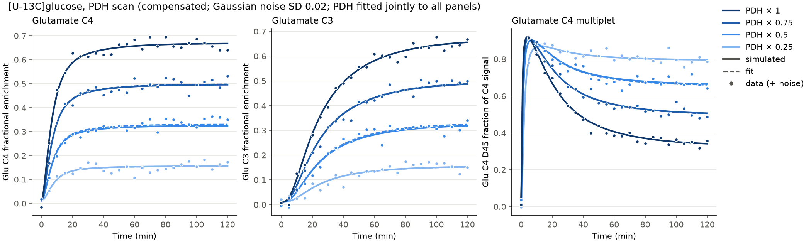
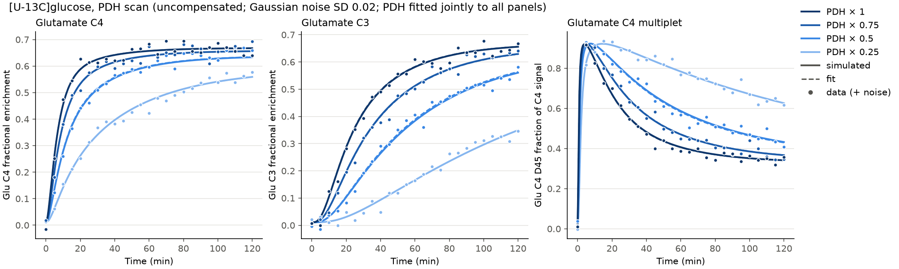
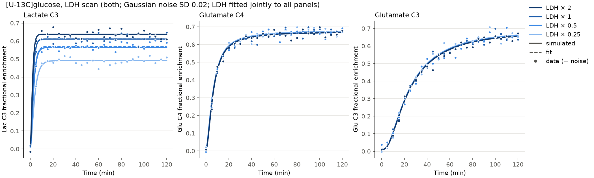
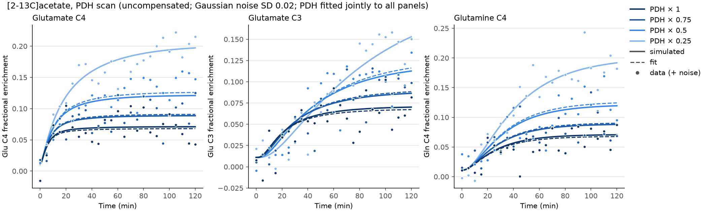

# c13model: ¹³C labeling from [U-¹³C]glucose or ¹³C-acetate vs. PDH and LDH activity

A Python simulation of brain TCA-cycle ¹³C labeling during an infusion of **¹³C-glucose**
and/or **¹³C-acetate**. You can vary two enzyme activities, separately:
* **pyruvate dehydrogenase (PDH)**;
* **lactate dehydrogenase (LDH)**.

Gaussian noise can be added to the output to make synthetic NMR data. Each activity can also
be fitted back from noisy data.

The pool structure follows the model of

> Mason GF, Rothman DL, Behar KL, Shulman RG. *NMR determination of the TCA cycle rate
> and α-ketoglutarate/glutamate exchange rate in rat brain.* J Cereb Blood Flow Metab.
> 1992;12(3):434-447. doi:[10.1038/jcbfm.1992.61](https://doi.org/10.1038/jcbfm.1992.61). PMID 1349022.

Mason et al. modeled [1-¹³C]glucose, which labels one carbon at a time. This model extends
theirs to multiply-labeled tracers such as [U-¹³C]glucose or [1,2-¹³C₂]acetate. Each pool
carries its **full isotopomer distribution** (all 2ⁿ labeling patterns), so it also gives the
NMR **multiplets** (C4 singlet vs. C4-C5 doublet, and so on).

## Model

```
 blood lactate ──V_mct_in──► Lac ◄───────────────────┐ LDH: Pyr→Lac = V_ldh + V_lac_net
     (FE_lac(t))              │ ──V_mct_out──► blood  │      Lac→Pyr = V_ldh
                              ▼                       │
 glucose (FE_glc(t)) ──V_gly──► Pyr ──────────────────┘
                                 │ V_PDH
 acetate (FE_ac(t)) ──V_ac──► AcCoA ◄──V_dil── other unlabeled substrates
                                 │  V_TCA = V_PDH + V_ac + V_dil
          Pyr ──V_PC──► OAA ─────┴──► citrate ──► α-KG ◄──V_x──► Glu ◄──V_gln──► Gln
                         ▲                          │
              Asp ◄─V_x─►│◄── succinate/fumarate ◄──┘  (symmetric: label scrambles)
```

| Pool | Carbons | Default size (µmol/g) |
|---|---|---|
| Pyruvate | 3 | 0.1 |
| Lactate | 3 | 1.0 |
| Acetyl-CoA | 2 | 0.02 |
| OAA | 4 | 0.02 |
| α-KG | 5 | 0.2 |
| Glutamate | 5 | 10 |
| Glutamine | 5 | 4 |
| Aspartate | 4 | 3 |

Carbon transitions:
* LDH keeps the carbon numbering of pyruvate and lactate.
* PDH: acetyl C1 ← Pyr C2, acetyl C2 ← Pyr C3.
* Acetate → acetyl-CoA: C1 ← acetate C1, C2 ← acetate C2.
* Citrate synthase → IDH: α-KG C1..C5 ← OAA C4, C3, C2, acetyl C2, acetyl C1. OAA C1 is lost as CO₂.
* α-KG dehydrogenase loses α-KG C1. The symmetric succinate step then maps it 50/50 back to OAA.
* PC: OAA C1..C3 ← Pyr C1..C3, and OAA C4 ← CO₂. Fumarate back-scrambling is optional.

For each pool of size *P*, `P·dx/dt = Σ V_in·x_in − (Σ V_out)·x`. Here `x` is the isotopomer
vector and every flux is at metabolic steady state. The equations are integrated with
`scipy.solve_ivp` (BDF).

### Tracers

* `Parameters(glucose_tracer=...)` accepts `"U-13C"` (default), `"1-13C"`, `"2-13C"`, `"6-13C"` or
  `None`.
* `Parameters(acetate_tracer=...)` accepts `"1-13C"`, `"2-13C"`, `"1,2-13C"` or `None` (default).
  It needs `V_ac > 0`.
* Both tracers can be set at once to simulate a co-infusion.
* Enrichment inputs are passed to `simulate(...)`:
  * `glucose_fe` and `acetate_fe` default to 0.7·(1−e^(−t/1 min)).
  * `lactate_fe` (blood lactate) defaults to 0.
  * Measured curves can be passed with `tabulated_enrichment(times, values)`.

### PDH activity: `with_pdh_activity(base, factor, mode, compensate_with)`

| mode | What changes |
|---|---|
| `compensated` | V_TCA stays fixed. The lost PDH flux is replaced by unlabeled substrates (`compensate_with="dil"`) or by acetate (`"acetate"`). |
| `uncompensated` | Other acetyl-CoA sources stay fixed, so V_TCA falls along with PDH. |

What this means for each tracer:
* **Glucose:** the steady-state Glu C4 FE is FE_pyr · V_PDH/V_TCA.
* **Acetate:** the steady-state Glu C4 FE is FE_ac · V_ac/V_TCA. Lowering PDH therefore
  *raises* acetate-derived labeling when uncompensated, and leaves it unchanged when
  compensated by unlabeled substrates.

### LDH activity: `with_ldh_activity(base, factor, mode)`

| mode | What changes |
|---|---|
| `both` (default) | The forward and reverse LDH fluxes both scale, as when the amount of enzyme changes at fixed metabolite levels. Net lactate production, and so glycolysis, scales too. |
| `exchange` | Only the Pyr ⇄ Lac exchange (`V_ldh`) scales. |
| `net` | Only net lactate production (`V_lac_net`) scales, and glycolysis adjusts to match. |

LDH has two effects:
* It sets how fast lactate labels.
* Because lactate also exchanges with unlabeled blood lactate (`V_mct_in`), faster LDH exchange
  dilutes pyruvate more. That slightly lowers glutamate labeling.

With acetate as the only tracer, LDH has no effect: the model has no route from the TCA cycle
back to pyruvate (see Limitations).

## Parameters: check against your references

| Parameter | Default | Source |
|---|---|---|
| `V_pdh` (+`V_ac`=`V_dil`=0 → V_TCA) | 1.58 µmol/g/min | Mason et al. 1992 (rat brain V_TCA) |
| `V_x` (α-KG↔Glu) | 57 µmol/g/min | **Unverified placeholder.** I couldn't reach the full text; check it against the paper |
| `V_ldh` 1.0, `V_lac_net` 0.05, `V_mct_in` 0.1 | µmol/g/min | Illustrative only |
| `V_ac` (0; 0.15 in the acetate example), `V_gln`, `V_pc`, pool sizes | see `Parameters` | Illustrative only |
| Precursor FE inputs | 0.7·(1−e^(−t/1 min)) | Illustrative; replace with measured values via `tabulated_enrichment` |
| `natural_abundance` | 0.011 | ¹³C natural abundance |

## Usage

```bash
pip install -e .[test]
pytest                                                   # run the tests
python examples/scan.py                                  # [U-13C]glucose, PDH scan
python examples/scan.py --enzyme ldh                     # [U-13C]glucose, LDH scan
python examples/scan.py --substrate acetate              # [2-13C]acetate, PDH scan
python examples/scan.py --substrate acetate --acetate-tracer 1,2-13C --mode compensated
python examples/scan.py --enzyme ldh --mode exchange --noise-sd 0.03
```

```python
from dataclasses import replace
from c13model import (Parameters, simulate, add_gaussian_noise, pdh_scan, ldh_scan,
                      with_pdh_activity, with_ldh_activity, fit_pdh, fit_ldh)

# [U-13C]glucose with PDH at 50 %
obs = simulate(with_pdh_activity(Parameters(), 0.5)).observables()

# [2-13C]acetate, glucose unlabeled
ace = Parameters(glucose_tracer=None, acetate_tracer="2-13C", V_ac=0.15)
obs = simulate(with_pdh_activity(ace, 0.5, "uncompensated")).observables()

# LDH at 25 %
obs = simulate(with_ldh_activity(Parameters(), 0.25)).observables()
obs[["Lac_C3_FE", "Glu_C4_FE", "Glu_C4_D45"]]

noisy = add_gaussian_noise(obs, sd=0.02, seed=1)                  # absolute SD, FE units
noisy = add_gaussian_noise(obs, sd=0.05, relative=True)           # 5 % relative SD

scan = ldh_scan([0.25, 0.5, 1, 2], mode="both")                   # long table, one block per factor
fit = fit_ldh(noisy.reset_index(), ["Lac_C3_FE", "Glu_C4_FE"])    # fitted LDH factor ± SE
fit.factor, fit.factor_se
```

`observables()` gives the following for Glu, Gln, Asp and Lac at each carbon *k*:
* `*_Ck_FE`: fractional enrichment.
* `*_Ck_conc`: ¹³C concentration in µmol/g.
* Multiplet fractions: `*_Ck_S`, `*_Ck_D{k-1}{k}`, `*_Ck_D{k}{k+1}` and `*_Ck_Q`. At Glu C3 the
  two doublets overlap, and `Q` appears as a triplet.

### Example script outputs

`examples/scan.py` simulates 4 activity levels and samples every 5 min with Gaussian noise. It
then fits the activity back for each level, using all panels jointly (`fit_activity`, least
squares with every other parameter fixed). It writes to
`examples/output/{substrate}_{enzyme}_{mode}/`, with **one CSV per plot panel, named from the
panel's y-axis label** (e.g. `Lac_C3_fractional_enrichment.csv`).

| Scan | Panels (y-axis → CSV) |
|---|---|
| glucose + PDH | Glu C4 FE, Glu C3 FE, Glu C4 D45 fraction of C4 signal |
| glucose + LDH | Lac C3 FE, Glu C4 FE, Glu C3 FE |
| acetate + PDH | Glu C4 FE, Glu C3 FE, Gln C4 FE |

Columns: `{enzyme}_factor, time_min, simulated, data, fit, fitted_{enzyme}_factor, fitted_{enzyme}_factor_se`.
Curves are on a 0.5 min grid. `data` is filled only at the sampled (5 min) points and is empty
everywhere else. Copies from the default runs (seed 0, SD 0.02) are in `docs/<scan>/`.

## Example output

Solid lines are the true simulation, dots are simulation + noise, and dashed lines are the fit.






## Limitations / next steps

* **The model has one compartment.** In brain, acetate is taken up and oxidised mainly by
  astrocytes, so it labels glutamine more than glutamate. Here Gln simply follows Glu. A
  neuron/astrocyte model with a glutamate-glutamine cycle would be needed to capture this.
* The model has no route from the TCA cycle back to pyruvate (malic enzyme/PEPCK), so acetate
  label never reaches lactate.
* Each fit estimates only one activity factor, with every other parameter fixed. LDH is hard
  to pin down once it is fast, because lactate then already tracks pyruvate.
